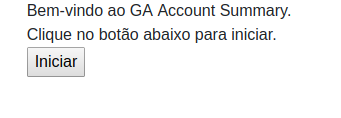
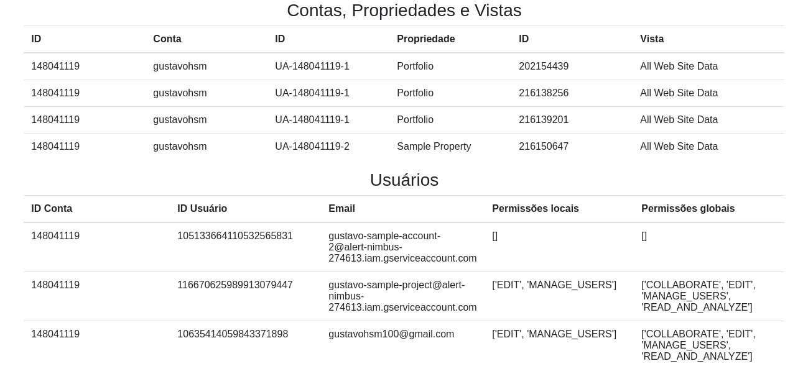
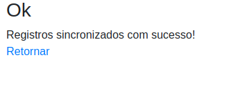
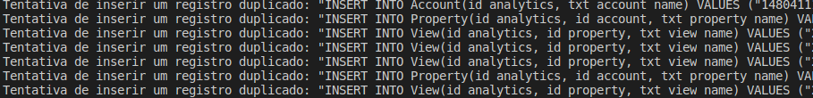

# GA Account Summary
Esta aplicação foi concebida para consultar a APIs do Google Analytics e buscar dados referentes a Contas, Propriedades, Vistas e Usuários envolvidos em um projeto.

A aplicação disponibilizará uma instância de servidor em ambiente local para interação do usuário com os dados coletados pelo Google Analytics, possibilitando que os dados obtidos sejam posteriormente integrados a um Database MySQL.

## Pré-requisitos
Para utilizar esta aplicação, é necessário:

1. Possuir uma conta associada ao [Google Analytics](https://analytics.google.com);
2. Autorizar a utilização da [Google Analytics API](https://console.developers.google.com/flows/enableapi?apiid=analytics)
3. Possuir uma [Conta de Serviço](https://console.developers.google.com/apis/credentials)

Após a criação da Conta de Serviço, faça download do "client_secret.json" e adicione-o à pasta *service_account_secrets*.
Para mais informações sobre a criação e utilização de contas de serviço, consulte [este link](https://developers.google.com/adwords/api/docs/guides/authentication#setting_up_service_account_access).

### Utilizando a integração com MySQL
Para utilizar a funcionalidade de integração com o MySQL, é necessário que exista uma instância deste SGBD instalada no ambiente de operação. 
Os scripts disponibilizados no arquivo 'start_db.sql' devem ser executados para iniciar a estrutura básica do DB. Isto pode ser feito com o seguinte comando:

`mysql < "start_db.sql"`

## Modo de utilização
Inicialmente, é necessário substituir o arquivo *template_client_secret.json* pelas credenciais de sua conta de serviço no Google Analytics.

No diretório da aplicação, ativar o ambiente virtual da aplicação com o seguinte comando:

`source venv/bin/activate`

Em seguida, executar o seguinte comando:

`venv/bin/python -m flask run`

Uma instância desta aplicação será disponibilizada para acesso HTTP no endereço http://127.0.0.1:5000, que pode ser acessada pelo usuário via Browser:

O usuário pode interagir com o botão "Iniciar", que irá utilizar a Conta de Serviço para disponibilizar um token de acesso à API e consultar as informações relevantes para esta aplicação:

Posteriormente, o usuário pode interagir com o botão "Sincronizar com DB MySQL" para guardar os dados obtidos num Database MySQL:

### Gerenciando erros e exceções
Quando ocorrer um erro durante a execução do aplicativo, o usuário será direcionado a uma página de erro e a aplicação registrará um stacktrace na pasta *logs* para análise de um desenvolvedor:

## Estrutura do Database
O Database desta aplicação segue o formato abaixo:

### Inserindo registros duplicados
A aplicação irá ignorar tentativas de duplicar um registro. Internamente, um alerta é emitido no console do servidor e a operação é cancelada com um rollback:

## Frameworks utilizados
* google-api, oauth2client: Para criar tokens de acesso à API do Google Analytics;
* Flask, Flask-WTF: Para disponibilizar o software como um serviço e renderizar interfaces HTML para interação com o usuário;
* mysql-connector: Para estabelecer a conexão entre a aplicação e um database MySQL;
* Bootstrap CSS: Utilizado nas páginas HTML para melhorar a visualização do conteúdo.

Os demais pacotes descritos no arquivo 'requirements.txt' são dependências dos frameworks listados acima
